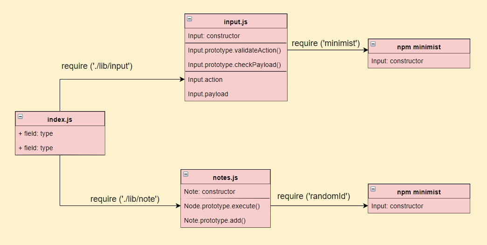

## Node Ecosystem

### Author: Husam Ajour

### Links and resources

| PR 1| [Link 1](https://github.com/HusamAjour/notes/pull/1)

| PR 2| [Link 2](https://github.com/HusamAjour/notes/pull/4)

### Modules

`input.js`
`notes.js`

### Packages

`minimist`

`random-id`

`random-id`

`jest`

### How to initialize/run the application

* e.g `node index.js --add 'note text`
* e.g `node index.js -a 'note text`
* e.g `./index.js --add 'note text`
* e.g `./index.js -a 'note text`

### Tests

```
npm test
```

### UML


